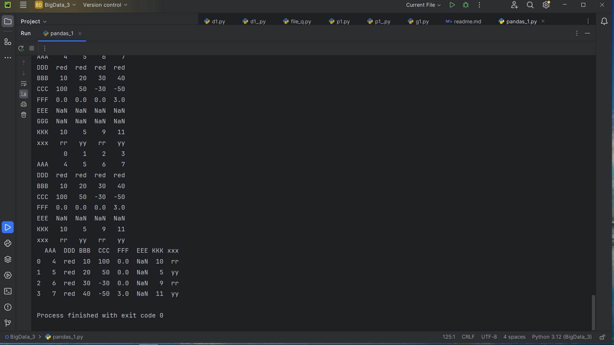
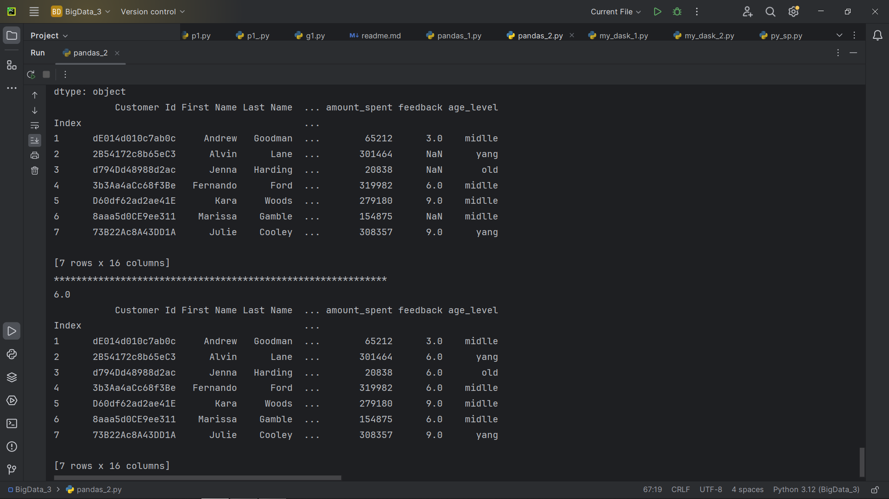
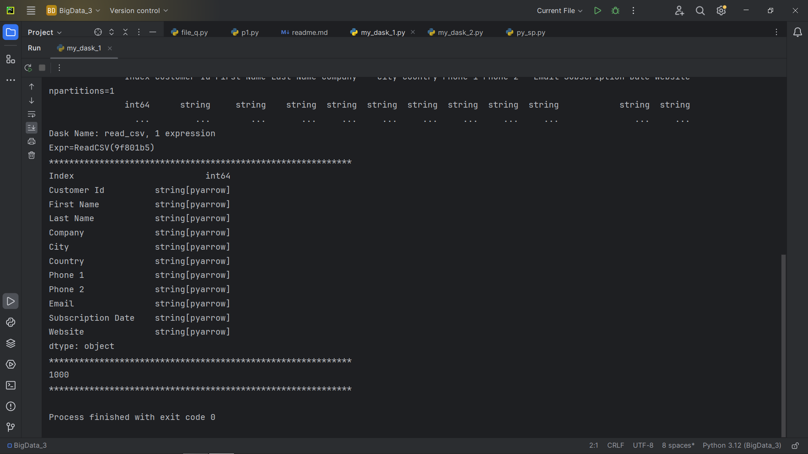
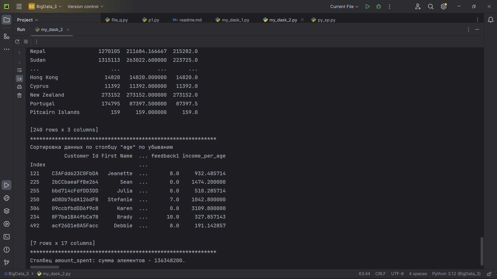
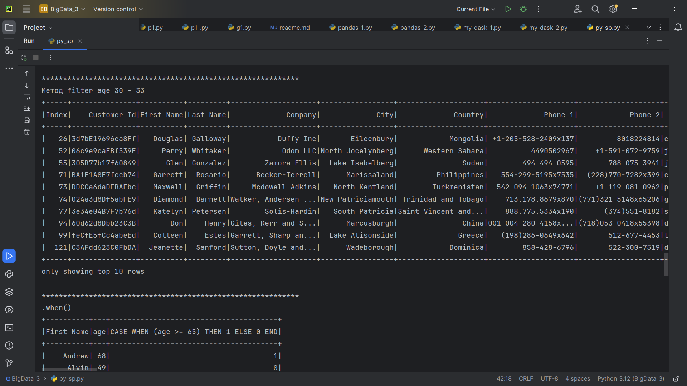
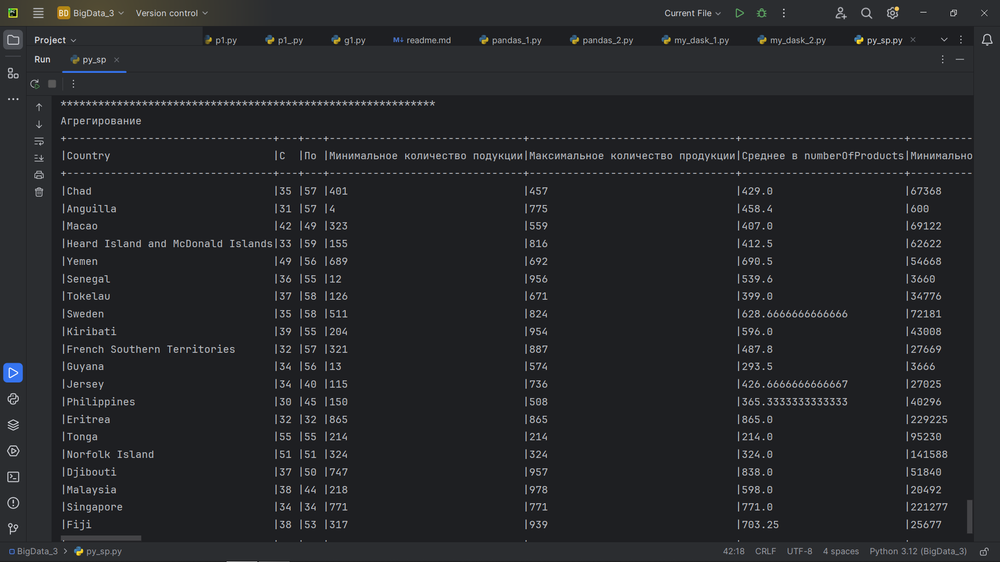
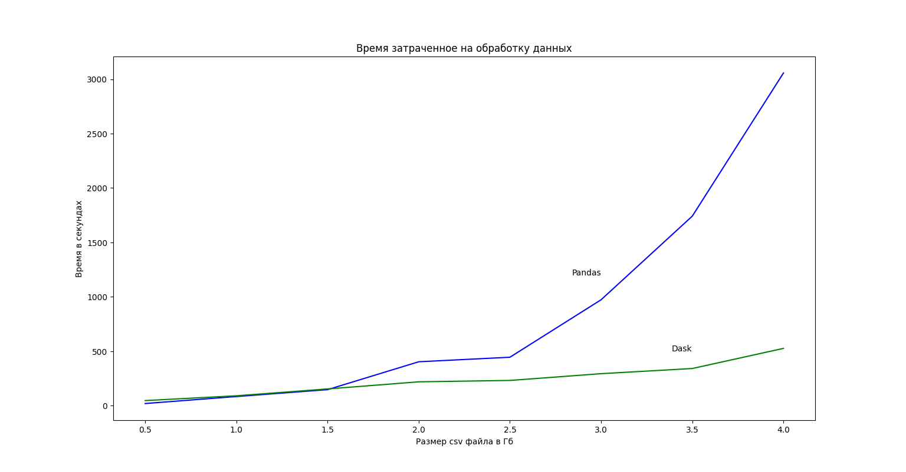

## О проекте

## Анализ и сравнение различных способов обработки и хранения больших данных: Pandas, Dask и Apache Spark

### Программа работает с файлами CSV и TXT.

### Созданы следующие приложения для анализа обработки данных, которые выводят в консоль результаты работы методов и функций:

- с использованием Pandas: pandas_1.py, pandas_2.py.

- с использованием Dask: my_dask_1.py, my_dask_2.py.

- с использованием Apache Spark: py_sp.py.

### Созданы следующие приложения для сравнения времени обработки данных:

- приложение file_q.py создает 8 файлов от 0,5 до 4 Гб.
- приложение p1_.py формирует датафрейм и производит отбор по запросу, используя Pandas, с подсчетом времени выполнения, сохраняя в TXT файл.
- приложение d1_.py формирует датафрейм и производит отбор по запросу, используя Dask, с подсчетом времени выполнения, сохраняя в TXT файл.
- приложение g1.py производит расчет ординат и визуализирует работу приложений

- Intel(R) Pentium(R) CPU N4200 @ 1.10GHz   1.10 GHz (4 ядра), ОЗУ 4,00 ГБ (доступно: 3,83 ГБ)